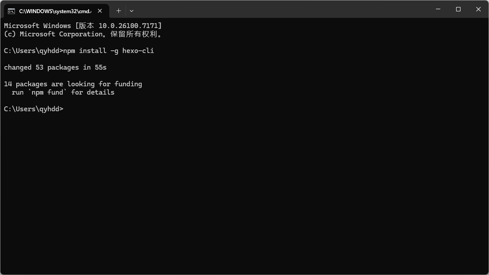
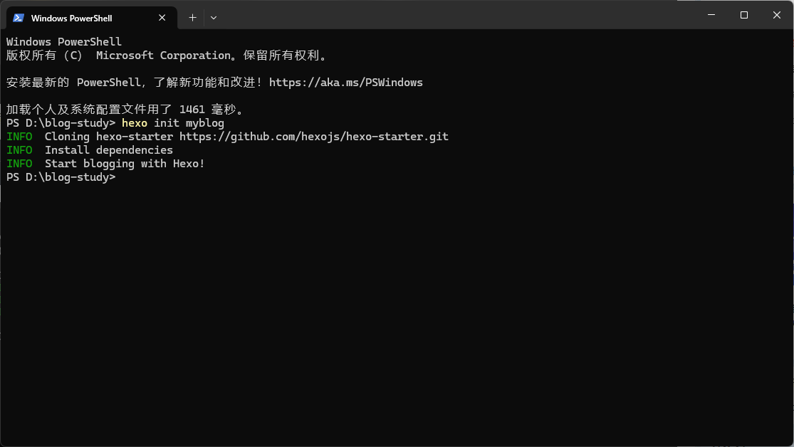
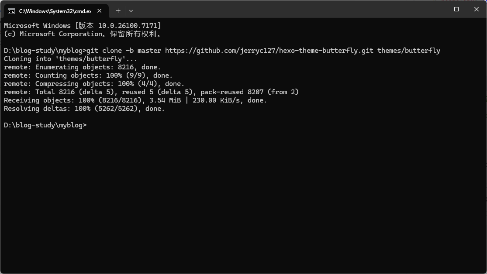
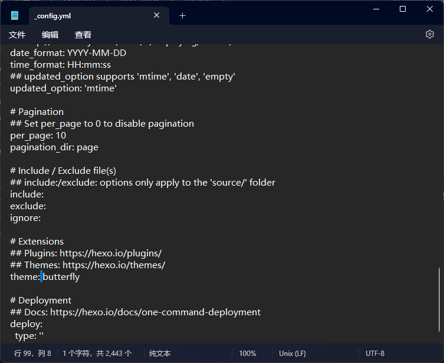

    欢迎来到我的博客！这是我的第一篇文章。

    最近想做一个对话的智能体，在浏览GitHub的时候进入某位大佬的项目，看到了他的博客，并且通过友链看了十来个博客，觉得很吊，所以我也想做一个。
    我在CSDN和哔站找了一些教程，很详细，但是对于我这个小白来说还是出现了一些问题，正好不知道写什么作为第一篇文章，所以就分享一下我的经验。

## 基于vercel和hexo搭建一个博客网站
    vercel：
    Vercel 是一个基于云的平台，用于部署和托管静态网站和服务器less函数。它提供了简单的部署流程，支持自动部署、自定义域名、SSL证书等功能。
    hexo：
    Hexo 是一个快速、简洁且高效的博客框架。它使用 Markdown 编写文章，支持插件扩展，并且可以生成静态网站。Hexo 是一个非常流行的博客框架，被许多人用于搭建个人博客。

### 前置准备
    安装 Node.js 和 Git（哔站上找教程或者直接问AI）
    之前做小程序用到过，所以这两个工具我都有安装。

### 基本思路
    1. 安装 Hexo-cli
    2. 创建新的 Hexo 博客项目
    3. 配置 Hexo 博客项目
    4. 部署 Hexo 博客项目到 Vercel

### 安装 Hexo-cli
在本地打开终端，执行以下命令安装 Hexo 命令行工具：
```bash
npm install -g hexo-cli
```


hexo-cli 是 Hexo 博客框架的命令行工具，核心作用是让你通过命令行快速操作 Hexo 博客（比如创建博客、生成文章、本地预览、部署上线等），无需手动配置复杂的构建流程。

### 创建新的 Hexo 博客项目
在一个你要存放博客项目的地方新建一个文件夹（我的在D盘的blog-study文件夹下），然后在该文件夹中打开终端（右键点击文件夹，选择“在终端中打开”），执行以下命令创建 Hexo 博客项目：
```bash
hexo init myblog （“myblog”可以修改为你喜欢的项目名）
```


继续在终端中执行以下命令：
```bash
cd myblog
# 进入博客项目目录
npm install
# 安装 Hexo 博客项目的依赖
hexo server
# 启动 Hexo 博客项目的开发服务器
```


Ctrl+左键网址 打开浏览器，就可以看到你的博客网站了。
Ctrl+C 停止开发服务器

### 配置 Hexo 博客项目
hexo就安装好了，接下来是美化博客网站。
我们可以使用 Hexo 博客框架的主题系统来美化博客网站，或者自己用AI生成一个主题（没试过）。
我选择了ｂｕｔｔｅｒｆｌｙ主题。

## 一、配置butterfly主题
# 1.安装butterfly主题
在博客根目录(即myblog文件夹)里安装最新版的ｂｕｔｔｅｒｆｌｙ主题：
```bash
git clone -b master https://github.com/jerryc127/hexo-theme-butterfly.git themes/butterfly
```


# 2.安装pug 和 stylus 渲染器。
```bash
npm install hexo-renderer-pug hexo-renderer-stylus --save
```


# 3.修改项目根目录下的_config.yml文件
```yaml
theme: butterfly
```


# 4.升级或切换主题的建议
我们可以将theme文件夹下面的_config.yml文件重命名为_config.butterfly.yml,再复制到项目根目录下。Hexo会将两个配置文件合并起来,如果有相同的配置项,则会以项目根目录下的配置项为准.这样,当升级或者切换主题时,只需要修改项目根目录下的配置文件,而不需要修改主题文件夹下的配置文件.


## 二、设置博客个人资料
在项目根目录下的_config.yml文件中，我们可以设置博客的个人资料，比如博客标题、描述、作者等。


基本的配置就这些，其他的可以根据自己的需求去配置,我现在就到这里。
之后再来分享部署到vercel的过程。

## 遇到的问题
1.中间会用到git,之后也会用到GitHub,需要用梯子或者其他方法。
2.安装pug 和 stylus 渲染器必须在blog根目录下执行,不要像安装hexo-cli一样在全局安装,否则会报错。
3.修改配置文件_config.butterfly.yml时,需要注意缩进问题,否则会报错。
4.修改_config.yml文件时,有的地方你填了文字,比方说副标题,但是并不显示,可以询问AI工具。

## 如果没有下载Node.js和git可以参考这个网址(没试过,在参考网址里有写到的,可以去试试)
https://blog.csdn.net/mjh1667002013/article/details/129064188

## 参考来源
https://blog.csdn.net/weixin_52908342/article/details/135173988?utm_medium=distribute.pc_relevant.none-task-blog-2~default~baidujs_utm_term~default-1-135173988-blog-140220912.235^v43^pc_blog_bottom_relevance_base4&spm=1001.2101.3001.4242.2&utm_relevant_index=3
https://blog.csdn.net/mjh1667002013/article/details/129290903?ops_request_misc=elastic_search_misc&request_id=8e2944d9732a4ae868516f301ecd8bf2&biz_id=0&utm_medium=distribute.pc_search_result.none-task-blog-2~all~top_positive~default-1-129290903-null-null.142^v102^pc_search_result_base9&utm_term=hexo%E4%B8%BB%E9%A2%98&spm=1018.2226.3001.4187

希望这篇文章对你有帮助！ 🎉

> 有问题欢迎留言讨论！